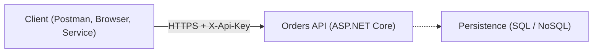
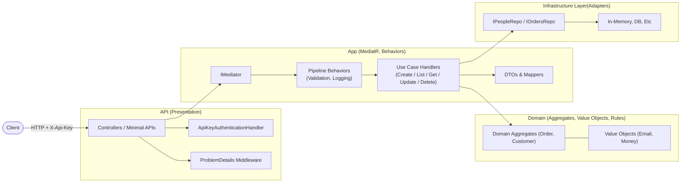
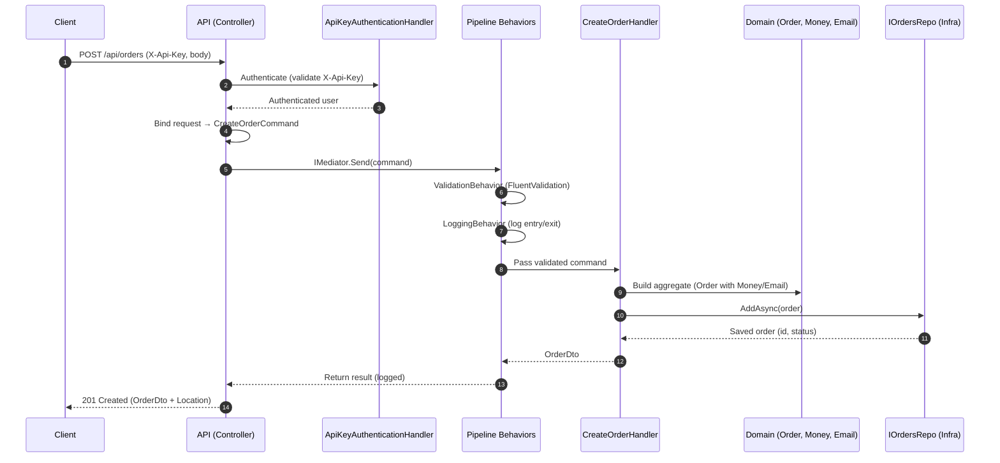

# Architecture Overview

## Goal

To demonstrate a conceptual example of how I structure layered applications. This project outlines the typical flow, responsibilities, and change seams used in my architectural style.

---

## System Context

This view shows how the Orders API fits within its environment. It highlights external clients that send requests and the optional persistence layer the API depends on.

---

## Container View

This view breaks the system into major parts: the API, Application, Domain, and Infrastructure layers. It shows how data and control flow between them.

---

## Component / Sequence: CreateOrder Flow

This sequence shows how components inside the Orders API work together to process a CreateOrder request, from the controller through validation and handlers to the repository.

---

## Clean Architecture Shape (Responsibilities)

| Layer                  | Responsibilities                                                            | Notes                                                              |
| ---------------------- | --------------------------------------------------------------------------- | ------------------------------------------------------------------ |
| **API (Presentation)** | Routing, API key auth, problem details, DI bootstrapping                    | Controllers/Minimal APIs are thin; no domain or persistence logic. |
| **Application**        | MediatR requests/handlers, DTO mapping, cross-cutting behaviors, validation | One handler = one use case; behaviors apply consistently.          |
| **Domain**             | Aggregates, invariants, value objects (`Email`, `Money`), business rules    | Pure .NET, dependency-free, unit-testable.                         |
| **Infrastructure**     | Repository implementations, mapping to/from persistence                     | In-memory today; swap implementations behind interfaces later.     |

---

## Request Walkthrough (POST `/api/orders`)

1. **Authentication middleware** (`ApiKeyAuthenticationHandler`) validates the `X-Api-Key` and short-circuits on failure before controllers run.
2. **Controller** binds the request payload and calls `IMediator.Send(new CreateOrderCommand(...))`.
3. **Pipeline behaviors** run:
   - **ValidationBehavior** executes FluentValidation rules.
   - **LoggingBehavior** records entry/exit messages around the handler.
4. **Handler** composes domain objects (`Order`, `Money`, `Email`) and calls `IOrdersRepo.AddAsync`.
5. **Repository** persists (in-memory or future DB) and returns the **domain** entity.
6. **Handler** maps domain → `OrderDto`.
7. **Controller** returns `201 Created` with DTO (and `Location` when applicable).

---

## Cross-Cutting Concerns

- **Authentication**: API key via custom handler; header `X-Api-Key`.
- **Validation**: FluentValidation in pipeline; throws a custom `ValidationException`.
- **Error Handling**: `AddProblemDetails` + exception middleware for RFC-7807 payloads.
- **Logging**: structured logs at behavior boundaries; handlers remain free of logging noise.

---

## Data & Persistence

- **Ports**: `ICustomersRepo`, `IOrdersRepo` in Application.
- **Adapters**: implementations in Infrastructure (`InMemory` today; `EF/Dapper` later).
- **Swap recipe**: add `EfOrdersRepo`/`EfCustomersRepo` → register in `Program.cs` → keep handlers/tests unchanged.
- **Mappings**: centralized helpers (e.g., `OrderMappings`, `MoneyMappings`) keep handlers lean and validate via value objects.

---

## Domain Rules: Order Status

- **States**: `New → Paid → Shipped` (no backward transitions).
- **Guards**:
  - `UpdateStatus` allows forward transitions (`New → Paid → Shipped`) and same-state repeats for idempotency.
  - Totals must be ≥ 0; `Money` enforces currency/amount validity.
- Rules live **inside aggregates/value objects** to remain consistent across all use-cases.

---

## Testing Strategy

- **Unit**: value objects, aggregates, mappings, validators, handlers (no I/O).
- **Integration**: `WebApplicationFactory<Program>` exercises auth, controllers, and repository seam via HTTP.
- **Mutation**: Stryker target ~75%+ mutation score to harden assertions.
- **Static Analysis & Coverage**: Coverlet → ReportGenerator (SonarQube XML) → SonarCloud.

---

## Change Seams & Evolution

- **Persistence**: swap repositories (Infra only).
- **Use-cases**: add a MediatR request + handler (App), plus validator and mapping as needed.
- **API surface**: add controller/endpoint thinly; no domain/persistence logic here.
- **Messaging (future)**: raise domain events (MediatR notifications) or publish to a broker—no handler changes required.
- **Observability**: add OpenTelemetry/health checks in API; behaviors can emit spans/metrics without touching handlers.

---

## Non-Functional Notes

- **Versioning**: prefer URL or media-type versioning when breaking DTOs; keep domain stable.
- **Security**: rotate API keys via config; store secrets in a secure vault; never log keys.
- **Performance**: handlers remain CPU-light; infra swaps unlock DB-level perf improvements.
- **Resilience**: wrap infra calls with retry/circuit-breaker when a real DB/broker is introduced.

---

## ADR Snapshot (Decisions)

1. **MediatR** over direct service wiring to standardize pipelines and reduce decorator boilerplate.
2. **FluentValidation** in behaviors for declarative rules and uniform error surfacing.
3. **Domain-first rules**—state transitions and invariants are enforced in the model.
4. **Repository pattern**—interfaces in Application, implementations in Infrastructure to isolate persistence.
5. **Swagger + XML comments** to keep docs close to code and visible at `/swagger`.

---

## Contributor Quickstart

- Add a new use-case: `Command/Query` → `Validator` → `Handler` → map to DTO → thin controller endpoint.
- Touch the **Domain** for any new rule or invariant; never hide rules in handlers.
- If persistence changes, implement a new repo and swap DI only.
